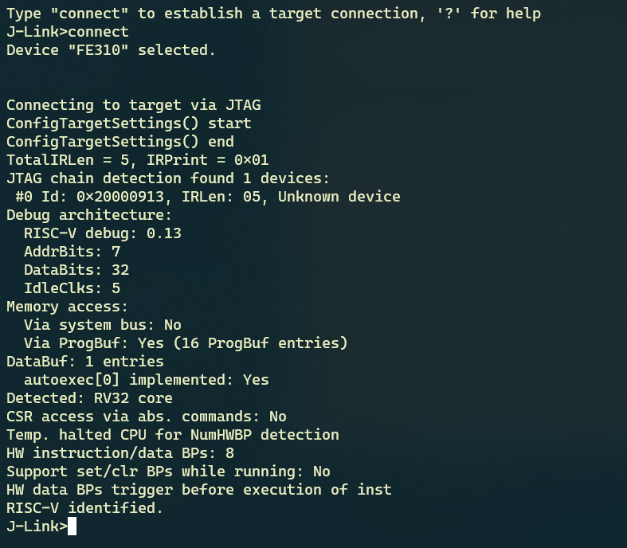

# 从零开始构建矽璓工业物联操作系统：使用risc-v架构的HiFive1 Rev B 开发板

[XiUOS](http://xuos.io/) (X Industrial Ubiquitous Operating System) 矽璓工业物联操作系统是一款面向工业物联场景的泛在操作系统，来自泛在操作系统研究计划。所谓泛在操作系统(UOS: Ubiquitous Operating Systems)，是支持互联网时代人机物融合泛在计算应用模式的新型操作系统，是传统操作系统概念的泛化与延伸。在泛在操作系统技术体系中，不同的泛在计算设备和泛在应用场景需要符合各自特性的不同UOS，XiUOS即是面向工业物联场景的一种UOS，主要由一个极简的微型实时操作系统(RTOS)内核和其上的智能工业物联框架构成，支持工业物联网(IIoT: Industrial Internet of Things)应用。

>注：最新版README请访问[从零开始构建矽璓工业物联操作系统：使用risc-v架构的HiFive1 Rev B 开发板](https://blog.csdn.net/AIIT_Ubiquitous/article/details/116259873)，如博客内容与本地文档有差异，以网站内容为准。

## 开发环境搭建

### 推荐使用：

**操作系统：** ubuntu18.04 [https://ubuntu.com/download/desktop](https://ubuntu.com/download/desktop)

**开发工具推荐使用 VSCode   ，VScode下载地址为：** VSCode  [https://code.visualstudio.com/](https://code.visualstudio.com/)，推荐下载地址为 [http://vscode.cdn.azure.cn/stable/3c4e3df9e89829dce27b7b5c24508306b151f30d/code_1.55.2-1618307277_amd64.deb](http://vscode.cdn.azure.cn/stable/3c4e3df9e89829dce27b7b5c24508306b151f30d/code_1.55.2-1618307277_amd64.deb)

### 依赖包安装：

```
$ sudo apt install build-essential pkg-config
$ sudo apt install gcc make libncurses5-dev openssl libssl-dev bison flex libelf-dev autoconf libtool gperf libc6-dev  git
```

**源码下载：** XiUOS [https://www.gitlink.org.cn/xuos/xiuos](https://www.gitlink.org.cn/xuos/xiuos)

新建一个空文件夹并进入文件夹中，并下载源码，具体命令如下：

```c
mkdir test  &&  cd test
git clone https://gitlink.org.cn/xuos/xiuos.git
```

1、打开XiUOS源码文件包可以看到以下目录：
| 名称 | 说明 |
| -- | -- |
| APP_Framework | 应用代码 |
| Ubiquitous | 板级支持包,支持NuttX、RT-Thread和XiZi内核 |
| | |
2、打开XiZi内核源码文件包可以看到以下目录：
| 名称 | 说明 |
| -- | -- |
| arch | 架构代码 |
| board | 板级支持包 |
| fs | 文件系统 |
| kernel | 内核源码 |
| lib | 第三方库源码 |
| resources | 驱动文件 |
| tool | 系统工具 |
| | |

使用VScode打开代码，具体操作步骤为：在源码文件夹下打开系统终端，输入`code .`即可打开VScode开发环境，如下图所示：

<div align= "center"> 

  </div>
  
### 裁减配置工具的下载

裁减配置工具：

**工具地址：** kconfig-frontends [https://www.gitlink.org.cn/xuos/kconfig-frontends](https://www.gitlink.org.cn/xuos/kconfig-frontends)

```c
mkdir kfrontends  && cd kfrontends
git clone https://gitlink.org.cn/xuos/kconfig-frontends.git
```

下载源码后按以下步骤执行软件安装：

```c
cd kconfig-frontends
 ./xs_build.sh
```

### 编译工具链：

RISC-V: riscv-none-embed-，默认安装到Ubuntu的/opt/，下载源码并解压。[下载网址 http://101.36.126.201:8011/gnu-mcu-eclipse.tar.bz2](http://101.36.126.201:8011/gnu-mcu-eclipse.tar.bz2)

```shell
$ tar -xjf gnu-mcu-eclipse.tar.bz2 -C /opt/
```

将上述解压的编译工具链的路径添加到board/hifive1-rev-B/config.mk文件当中，例如：

```
export CROSS_COMPILE ?=/opt/gnu-mcu-eclipse/riscv-none-gcc/8.2.0-2.1-20190425-1021/bin/riscv-none-embed-
```

若已存在`export CROSS_COMPILE ?=xxxx`   应该将原有的语句注释，再写入上面的语句。

# 在HiFive1 Rev B board 上创建第一个应用

## 1.HiFive1 Rev B board 简介

| 硬件 | 描述 |
| -- | -- |
|芯片型号| FE310-G002 |
|架构| RV32IMAC |
|主频| 320+MHz |
|片内SRAM| 16KB |
| 外设 | UART、SPI、I2C |

XiUOS板级当前支持使用UART。

## 2. 代码编写与编译说明

编辑环境：`VScode`

编译工具链：`riscv-none-embed-gcc`

使用`VScode`打开工程的方法有多种，本文介绍一种快捷键，在项目目录下将`code .`输入终端即可打开目标项目

修改`APP_Framework/Applications`文件夹下`main.c`

在输出函数中写入  Hello, world!  \n running on Hifive1 Rev B  board完成代码编辑。


编译步骤：

1.在VScode终端下执行以下命令，生成配置文件

```
cd ./Ubiquitous/XiZi
make BOARD=hifive1-rev-B distclean
make BOARD=hifive1-rev-B menuconfig
```

2.在menuconfig界面配置需要关闭和开启的功能，按回车键进入下级菜单，按Y键选中需要开启的功能，按N键选中需要关闭的功能，配置结束后选择Exit保存并退出


3.继续执行以下命令，进行编译

```
make BOARD=hifive1-rev-B
```

4.如果编译正确无误，build文件夹下会产生XiZi_hifive1-rev-B.elf、XiZi_hifive1-rev-B.bin文件。其中XiZi_hifive1-rev-B.bin需要烧写到设备中进行运行。

>注：最后可以执行以下命令，清除配置文件和编译生成的文件

```
make BOARD=hifive1-rev-B distclean
```

## 3. 烧写及执行

hifive1-rev-B支持J-Link，可以通过J-Link进行烧录和调试。


首先电脑需要安装J-Link Software and Documentation Pack，这里以Ubuntu18.04为例，下载[JLink_Linux_V700_x86_64.deb](https://www.segger.com/downloads/jlink/JLink_Linux_V700_x86_64.deb)，推荐使用[http://101.36.126.201:8011/JLink_Linux_V700_x86_64.deb](http://101.36.126.201:8011/JLink_Linux_V700_x86_64.deb)下载，然后执行以下命令安装到电脑上

```c
sudo apt install  ./JLink_Linux_V700_x86_64.deb
```

使用 Micro USB 线将开发板与电脑连接，终端执行以下命令进入J-Link控制台，并通过J-Link连接设备

```c
JLinkExe -device FE310 -if jtag -jtagconf -1,-1 -speed 4000
```

命令执行成功后终端如下图：


在J-Link控制台输入connect连接设备，如下图：



接着输入erase命令擦除FLASH，如图：


输入loadbin命令，并指定烧录的bin文件和烧录地址，将bin文件烧录到开发板中，如图：


### 3.1 运行结果

如果编译 & 烧写无误，可以通过screen工具打开串口终端，hifive1-rev-B连接电脑后，在/dev 目录下会多出/dev/ttyACM0、/dev/ttyACM1两个串口设备，一般串口输出为/dev/ttyACM0，通过screen命令打开串口：

```
sudo apt install screen
screen /dev/ttyACM0 115200
```

按下开发板Reset按钮，将会在串口终端上看到信息打印输出


