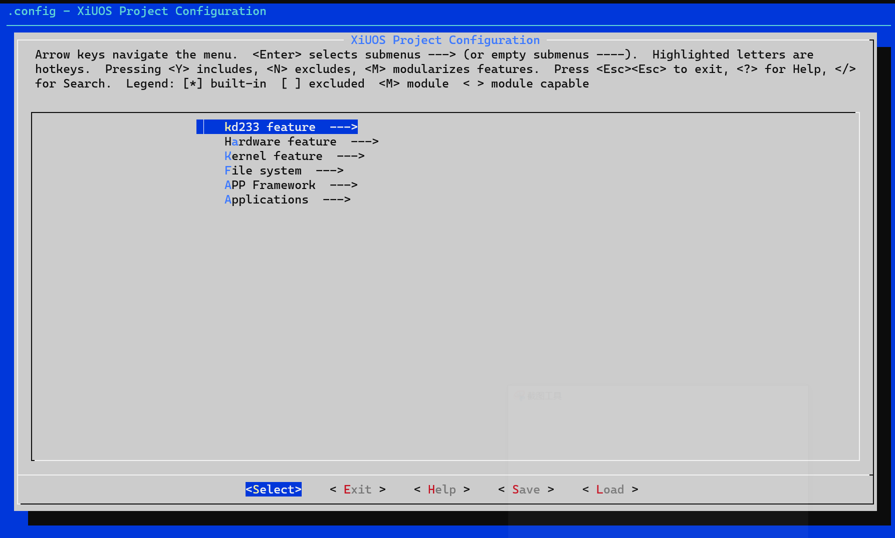
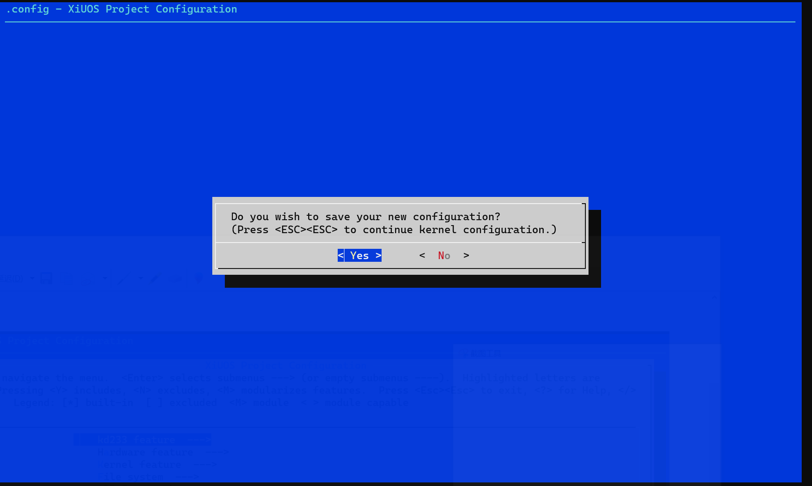
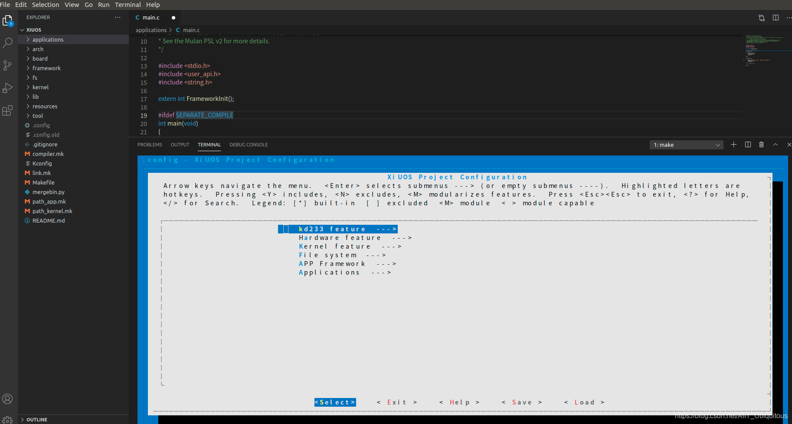

# 从零开始构建矽璓工业物联操作系统：使用risc-v架构的k210 emulator

# k210 emulator

[XiUOS](http://xuos.io/) (X Industrial Ubiquitous Operating System) 矽璓XiUOS是一款面向智慧车间的工业物联网操作系统，主要由一个极简的微型实时操作系统内核和其上的工业物联框架构成，通过高效管理工业物联网设备、支撑工业物联应用，在生产车间内实现智能化的“感知环境、联网传输、知悉识别、控制调整”，促进以工业设备和工业控制系统为核心的人、机、物深度互联，帮助提升生产线的数字化和智能化水平。

>注：最新版README请访问[从零开始构建矽璓工业物联操作系统：使用risc-v架构的k210 emulator](https://blog.csdn.net/AIIT_Ubiquitous/article/details/116610203)，如博客内容与本地文档有差异，以网站内容为准。

## 1. 简介

Q‎EMU 是一个通用的开源模拟器和虚拟化工具。‎从5.0版本开始，Q‎EMU已经可以较完整的支持RISC-V架构。目前XiUOS同样支持运行在Q‎EMU上

| 硬件 | 描述 |
| -- | -- |
|芯片型号| K210 |
|架构| 双核RV64GC |
|主频| 400MHz |
|片内SRAM| 8MB |
| 外设支持 | UART |

XiUOS板级当前支持使用UART。

## 2. 编译说明

**操作系统：** ubuntu18.04 [https://ubuntu.com/download/desktop](https://ubuntu.com/download/desktop)

**开发工具推荐使用 VSCode   ，VScode下载地址为：** VSCode  [https://code.visualstudio.com/](https://code.visualstudio.com/)，推荐下载地址为 [http://vscode.cdn.azure.cn/stable/3c4e3df9e89829dce27b7b5c24508306b151f30d/code_1.55.2-1618307277_amd64.deb](http://vscode.cdn.azure.cn/stable/3c4e3df9e89829dce27b7b5c24508306b151f30d/code_1.55.2-1618307277_amd64.deb)

### 依赖包安装：

```
$ sudo apt install build-essential pkg-config
$ sudo apt install gcc make libncurses5-dev openssl libssl-dev bison flex libelf-dev autoconf libtool gperf libc6-dev  git
```

**XiUOS操作系统源码下载：** XiUOS [https://www.gitlink.org.cn/xuos/xiuos](https://www.gitlink.org.cn/xuos/xiuos)

新建一个空文件夹并进入文件夹中，并下载源码，具体命令如下：

```c
mkdir test  &&  cd test
git clone https://gitlink.org.cn/xuos/xiuos.git
```

1、打开XiUOS源码文件包可以看到以下目录：
| ------------- | ------- |
| APP_Framework | 应用代码 |
| Ubiquitous    | 板级支持包,支持NuttX、RT-Thread和XiZi内核 |
2、打开XiZi内核源码文件包可以看到以下目录：
| ------------- | --------|
| arch          | 架构代码 |
| board         | 板级支持包 |
| fs            | 文件系统 |
| kernel        | 内核源码 |
| lib           | 第三方库源码 |
| resources     | 驱动文件 |
| tool          | 系统工具 |

使用VScode打开代码，具体操作步骤为：在源码文件夹下打开系统终端，输入`code .`即可打开VScode开发环境，如下图所示：


### 裁减配置工具的下载

**裁减配置工具：** kconfig-frontends [https://www.gitlink.org.cn/xuos/kconfig-frontends](https://www.gitlink.org.cn/xuos/kconfig-frontends)
执行以下命令下载配置工具：

```c
mkdir kfrontends  && cd kfrontends
git clone https://gitlink.org.cn/xuos/kconfig-frontends.git
```

下载源码后按以下步骤执行软件安装：

```c
cd kconfig-frontends
 ./xs_build.sh
```

### 编译工具链：

RISC-V: riscv-none-embed-，默认安装到Ubuntu的/opt/，下载源码并解压。[下载网址 http://101.36.126.201:8011/gnu-mcu-eclipse.tar.bz2](http://101.36.126.201:8011/gnu-mcu-eclipse.tar.bz2)，下载完成后，执行以下命令：

```c
sudo tar -xvjf gnu-mcu-eclipse.tar.bz2 -C /opt/
```

在VScode中将上述解压的编译工具链的路径添加到board/k210-emulator/config.mk文件当中，操作如下：

```c
export CROSS_COMPILE ?=/opt/gnu-mcu-eclipse/riscv-none-gcc/8.2.0-2.1-20190425-1021/bin/riscv-none-embed-
```

若`CROSS_COMPILE `  变量定义语句已经存在，将它替换成上面的语句

# 编译步骤：

1.在`VScode`的“命令终端”中执行以下命令，生成配置文件

```
cd ./Ubiquitous/XiZi
make BOARD=k210-emulator distclean
make BOARD=k210-emulator menuconfig
```

2.在menuconfig界面配置需要关闭和开启的功能，按回车键进入下级菜单，按Y键选中需要开启的功能，按N键选中需要关闭的功能，配置结束后选择Exit保存并退出（本例旨在演示简单的输出例程，所以没有需要配置的选项，双击快捷键ESC退出配置）



退出时选择`yes`保存上面所配置的内容，如下图所示：



若执行 `make BOARD=k210-emulator menuconfig`后出现以下界面：


解决的方法是将终端向上拉伸超过当前界面的三分之二以上，效果如下：



3.继续在VScode命令终端中执行以下命令，进行编译

```c
make BOARD=k210-emulator
```

4.如果编译正确无误，会在build目录下产生XiZi_k210-emulator.elf、XiZi_k210-emulator.bin文件。

## 3. 运行

### 3.1 编译并安装Q‎EMU

**QEMU v6.0.0源码下载：** Qemu-K210 Emulator for XiUOS [https://forgeplus.trustie.net/projects/xuos/QemuK210](https://forgeplus.trustie.net/projects/xuos/QemuK210)

```
git clone https://git.trustie.net/xuos/QemuK210.git
sudo apt  install  ninja-build libpixman-1-dev
cd QemuK210
./configure --target-list=riscv64-softmmu
make
sudo make install
```

### 3.2 运行结果

通过以下命令启动Q‎EMU并加载XiUOS ELF文件

```
qemu-system-riscv64 -nographic -machine sifive_u -bios build/XiZi_k210-emulator.elf
```

QEMU运行起来后将会在终端上看到信息打印输出


### 3.3 调试

利用Q‎EMU可以方便的对XiUOS进行调试，首先通过以下命令启动Q‎EMU

```
qemu-system-riscv64 -nographic -machine sifive_u -bios build/XiZi_k210-emulator.elf -s -S
```

然后要重新开启另一个linux系统终端一个终端，执行`riscv-none-embed-gdb`命令

```
riscv-none-embed-gdb build/XiZi_k210-emulator.elf -ex "target remote localhost:1234"
```
