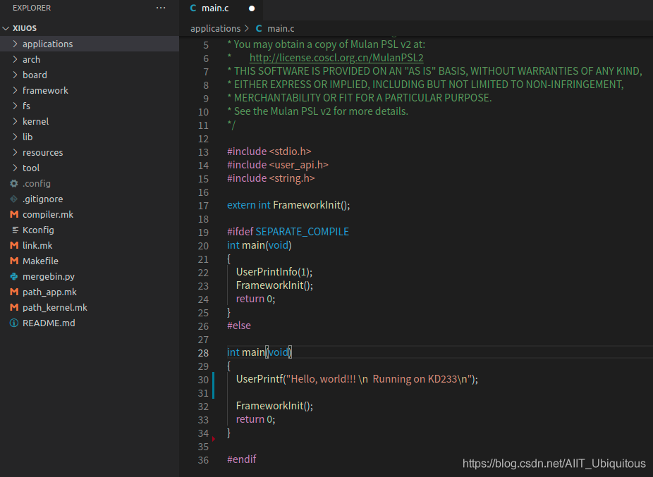
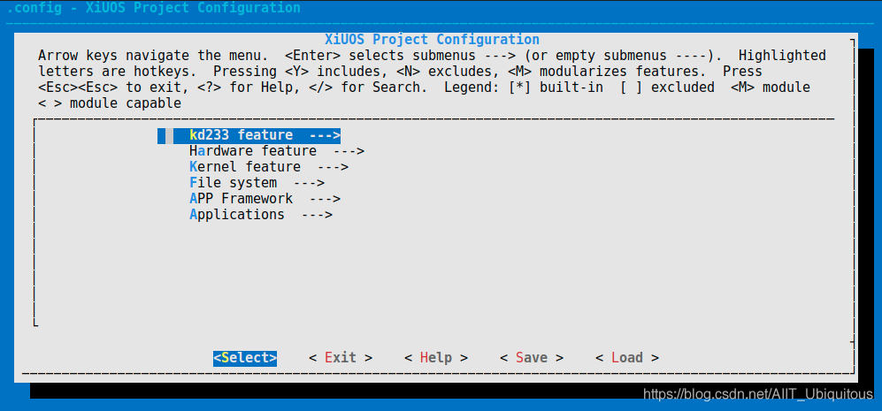
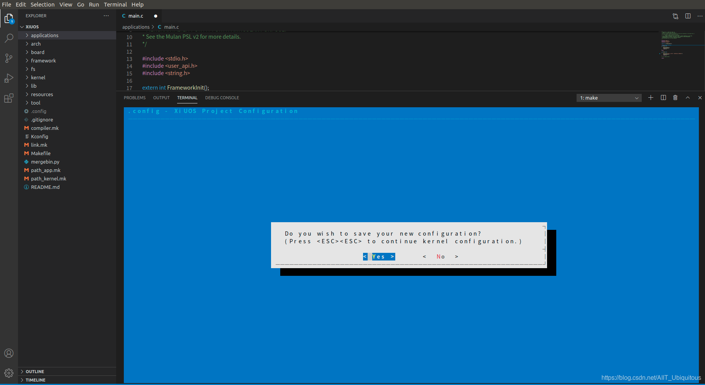
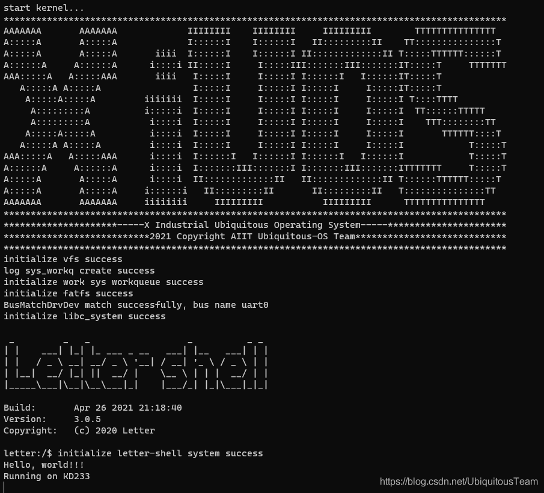

# 从零开始构建矽璓工业物联操作系统：使用risc-v架构的kd233开发板

[XiUOS](http://xuos.io/) (X Industrial Ubiquitous Operating System) 矽璓XiUOS是一款面向智慧车间的工业物联网操作系统，主要由一个极简的微型实时操作系统内核和其上的工业物联框架构成，通过高效管理工业物联网设备、支撑工业物联应用，在生产车间内实现智能化的“感知环境、联网传输、知悉识别、控制调整”，促进以工业设备和工业控制系统为核心的人、机、物深度互联，帮助提升生产线的数字化和智能化水平。

>注：最新版README请访问[从零开始构建矽璓工业物联操作系统：使用risc-v架构的kd233开发板](https://blog.csdn.net/AIIT_Ubiquitous/article/details/116175737)，如博客内容与本地文档有差异，以网站内容为准。

## 开发环境搭建

### 推荐使用：

**操作系统：** ubuntu18.04 [https://ubuntu.com/download/desktop](https://ubuntu.com/download/desktop)
**开发工具推荐使用 VSCode   ，VScode下载地址为：** VSCode  [https://code.visualstudio.com/](https://code.visualstudio.com/)，推荐下载地址为 [http://vscode.cdn.azure.cn/stable/3c4e3df9e89829dce27b7b5c24508306b151f30d/code_1.55.2-1618307277_amd64.deb](http://vscode.cdn.azure.cn/stable/3c4e3df9e89829dce27b7b5c24508306b151f30d/code_1.55.2-1618307277_amd64.deb)

### 依赖包安装：

```
$ sudo apt install build-essential pkg-config
$ sudo apt install gcc make libncurses5-dev openssl libssl-dev bison flex libelf-dev autoconf libtool gperf libc6-dev  git
```

**源码下载：** XiUOS [https://www.gitlink.org.cn/xuos/xiuos](https://www.gitlink.org.cn/xuos/xiuos)
新建一个空文件夹并进入文件夹中，并下载源码，具体命令如下：

```c
mkdir test  &&  cd test
git clone https://gitlink.org.cn/xuos/xiuos.git
```

1、打开XiUOS源码文件包可以看到以下目录：
| ------------- | ------- |
| APP_Framework | 应用代码 |
| Ubiquitous    | 板级支持包,支持NuttX、RT-Thread和XiZi内核 |
2、打开XiZi内核源码文件包可以看到以下目录：
| ------------- | --------|
| arch          | 架构代码 |
| board         | 板级支持包 |
| fs            | 文件系统 |
| kernel        | 内核源码 |
| lib           | 第三方库源码 |
| resources     | 驱动文件 |
| tool          | 系统工具 |

使用VScode打开代码，具体操作步骤为：在源码文件夹下打开系统终端，输入`code .`即可打开VScode开发环境，如下图所示：

<div align= "center"> 

  </div>

### 裁减配置工具的下载
**裁减配置工具：** kconfig-frontends [https://www.gitlink.org.cn/xuos/kconfig-frontends](https://www.gitlink.org.cn/xuos/kconfig-frontends)
执行以下命令下载配置工具：

```c
mkdir kfrontends  && cd kfrontends
git clone https://gitlink.org.cn/xuos/kconfig-frontends.git
```

下载源码后按以下步骤执行软件安装：

```c
cd kconfig-frontends
./xs_build.sh
```

### 编译工具链：

RISC-V: riscv-none-embed-，默认安装到Ubuntu的/opt/，下载源码并解压。[下载网址 http://101.36.126.201:8011/gnu-mcu-eclipse.tar.bz2](http://101.36.126.201:8011/gnu-mcu-eclipse.tar.bz2)

```shell
$ tar -xjf gnu-mcu-eclipse.tar.bz2 -C /opt/
```

将上述解压的编译工具链的路径添加到board/kd233/config.mk文件当中，例如：

```
export CROSS_COMPILE ?=/opt/gnu-mcu-eclipse/riscv-none-gcc/8.2.0-2.1-20190425-1021/bin/riscv-none-embed-
```

若`CROSS_COMPILE `  变量定义语句已经存在，将它替换成上面的语句

# 在KD233上创建第一个应用 --helloworld

# KD233开发板简介

## 1. 微处理器简介

| 硬件 | 描述 |
| -- | -- |
|芯片型号| K210 |
|CPU| 双核RV64GC |
|主频| 400MHz |
|片内SRAM| 8MB |
| 外设 | DVP、JTAG、OTP、FPIOA、GPIO、UART、SPI、RTC、I²S、I²C、WDT、Timer与PWM |

XiUOS板级当前支持使用GPIO、I2C、LCD、RTC、SPI、Timer、UART、watchdog。

## 2. 代码编写与编译说明

编辑环境：`VScode`

编译工具链：`riscv-none-embed-gcc`
使用`VScode`打开工程的方法有多种，本文介绍一种快捷键，在项目目录下将`code .`输入终端即可打开目标项目

修改`APP_Framework/Applications`文件夹下`main.c`
在输出函数中写入  Hello, world!!!  \n Running on KD233完成代码编辑。



编译步骤：

1.在`VScode`的“命令终端”下执行以下命令，生成配置文件

```c
cd ./Ubiquitous/XiZi
make BOARD=kd233 distclean
make BOARD=kd233 menuconfig
```

2.在`menuconfig`界面配置需要关闭和开启的功能，按回车键进入下级菜单，按Y键选中需要开启的功能，按N键选中需要关闭的功能，配置结束后选择Exit保存并退出（本实验无需选择任何选项，所以双击ESC结束选择，继续操作即可）。



双击`ESC`键会出现如下图所示结果：



选择`yes`键退出。

若执行 `make BOARD=kd233 menuconfig`后出现以下界面：


解决的方法是将终端向上拉伸超过当前界面的三分之二以上，效果如下：


3.继续在`VScode`的“命令终端”中执行以下命令，进行编译

```c
make BOARD=kd233
```

4.如果编译正确无误，会在build文件夹下生成XiZi_kd233.elf、XiZi_kd233.bin文件。其中XiZi_kd233.bin需要烧写到设备中进行运行。

>注：最后可以执行以下命令，清除配置文件和编译生成的文件

```c
make BOARD=kd233 distclean
```

## 3. 烧写及执行

连接开发板串口（即Type-C口）到USB接口，拨动电源开关打开开发板，然后使用K-Flash工具进行烧写bin文件。


执行以下命令安装K-Flash工具

```
sudo apt install python3 python3-pip
sudo pip3 install pyserial
sudo pip3 install pyelftools
sudo pip3 install kflash
```

如果最后一步安装kflash出现错误，可以尝试以下命令

```
sudo python -m pip install kflash
sudo python3 -m pip install kflash
sudo pip install kflash
sudo pip2 install kflash
```

代码根目录下执行K-Flash工具烧录，-p为USB端口号，视实际情况而定

```
sudo kflash -t build/XiZi_kd233.bin -p /dev/ttyUSB0
```

### 3.1 运行结果

如果编译 & 烧写无误，将会在串口终端上看到信息打印输出。


