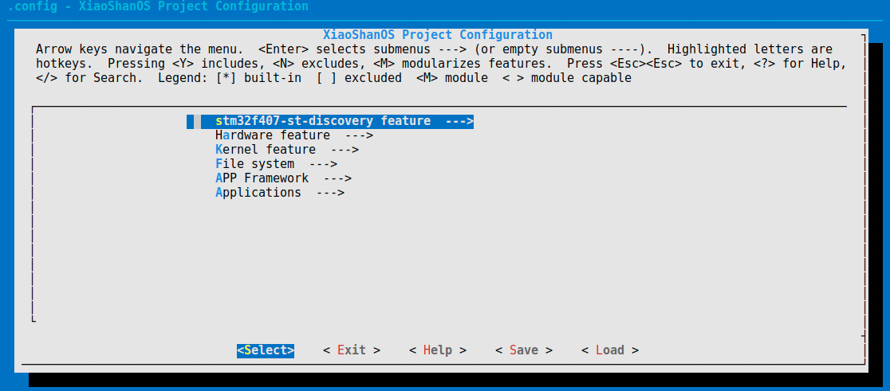

# Stm32F407zgt6-BOARD README

## 1. 简介

| 硬件 | 描述 |
| -- | -- |
|芯片型号| Stm32F407zgt6|
|CPU|arm cortex-m|
|主频| 168MHz |
|片内SRAM| 192KB |
|扩展SRAM| 1MB |
|片上FLASH| 512KB |
| 外设 | 内嵌FPU处理器 |
| | DCMI、JTAG、OTG、ADC、DAC、USB、GPIO、UART、SPI、SDIO、RTC、I²S、CAN、DMA、MAC、I²C、WDT、Timer与PWM |

XiUOS板级当前支持使用GPIO和UART。

## 2. 编译说明

### 编译环境：Ubuntu18.04

### 编译工具链：arm-none-eabi-gcc

编译步骤：
>	1.ARM下编译需要安装arm-none-eabi编译工具, 安装到Ubuntu的默认路径/usr/bin/arm-none-eabi-，使用如下命令行下载
```
sudo apt-get install gcc-arm-none-eabi
```
>2.在代码根目录下执行以下命令，生成配置文件

```
cd ./Ubiquitous/XiZi
make BOARD=stm32f407zgt6 distclean
make BOARD=stm32f407zgt6 menuconfig
```
>3.在menuconfig界面配置需要关闭和开启的功能，按回车键进入下级菜单，按Y键选中需要开启的功能，按N键选中需要关闭的功能，配置结束后保存并退出



>4.继续执行以下命令，进行编译
```
make BOARD=stm32f407zgt6
```
>5.如果编译正确无误，会产生XiZi_stm32f407zgt6.elf、XiZi_stm32f407zgt6.bin文件。其中XiZi_stm32f407zgt6.bin需要烧写到设备中进行运行。
```
sudo write build/XiZi_stm32f407zgt6.bin 0x8000000
```
>6.最后可以执行以下命令，清除配置文件和编译生成的文件
```
make BOARD=stm32f407zgt6 distclean
```

## 3. 烧写及执行

将 BOARD=stm32f407zgt6开发板SWD经 st-link 转接到USB接口，然后使用st-flash工具进行烧写bin文件。

执行以下命令下载st-link工具
```
git clone https://github.com/texane/stlink.git
```

开发板接口如下：
<div align= "center"> 

  </div>

  实际连接图为：
  <div align= "center"> 

  </div>

在代码根目录下执行st-flash工具烧录
```
sudo st-flash write build/XiZi_stm32f407zgt6.bin 0x8000000
```
### 3.1 运行结果

如果编译 & 烧写无误，将会在串口终端上看到信息打印输出，(终端串口引脚为PB6、PB7)。
  <div align= "center"> 

  </div>
