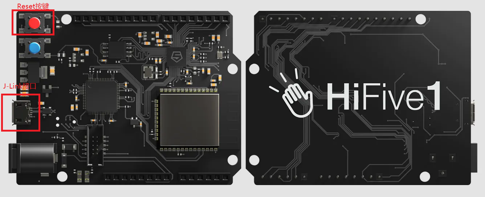
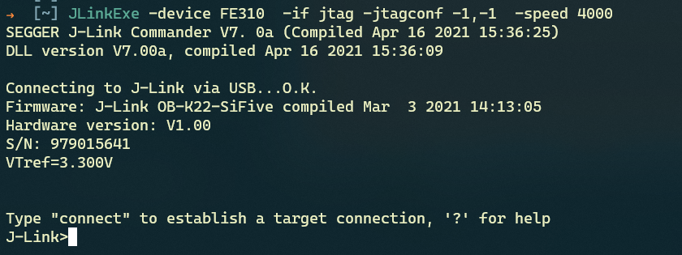

# hifive1 Rev B board README

## 1. 简介

| 硬件 | 描述 |
| -- | -- |
|芯片型号| FE310-G002 |
|架构| RV32IMAC |
|主频| 320+MHz |
|片内SRAM| 16KB |
| 外设 | UART、SPI、I2C |

XiUOS板级当前支持使用UART。

## 2. 编译说明

编译环境：Ubuntu18.04

编译工具链：[riscv-none-embed-gcc](https://github.com/ilg-archived/riscv-none-gcc/releases)

编译步骤：

>1.将编译工具链的路径添加到board/hifive1-rev-B/config.mk文件当中，例如将gnu-mcu-eclipse-riscv-none-gcc-8.2.0-2.1-20190425-1021-centos64.tgz解压到/opt/下时添加：
```
export CROSS_COMPILE ?=/opt/gnu-mcu-eclipse/riscv-none-gcc/8.2.0-2.1-20190425-1021/bin/riscv-none-embed-
```
>2.在代码根目录下执行以下命令，生成配置文件
```
make BOARD=hifive1-rev-B menuconfig
```
>3.在menuconfig界面配置需要关闭和开启的功能，按回车键进入下级菜单，按Y键选中需要开启的功能，按N键选中需要关闭的功能，配置结束后选择Exit保存并退出


>4.继续执行以下命令，进行编译
```
make BOARD=hifive1-rev-B
```
>5.如果编译正确无误，会产生XiUOS_hifive1-rev-B.elf、XiUOS_hifive1-rev-B.bin文件。其中XiUOS_hifive1-rev-B.bin需要烧写到设备中进行运行。
>注：最后可以执行以下命令，清除配置文件和编译生成的文件
```
make BOARD=hifive1-rev-B distclean
```

## 3. 烧写及执行

hifive1-rev-B支持J-Link，可以通过J-Link进行烧录和调试。



首先电脑需要安装J-Link Software and Documentation Pack，这里以Ubuntu18.04为例，下载[JLink_Linux_V700_x86_64.deb](https://www.segger.com/downloads/jlink/JLink_Linux_V700_x86_64.deb)，执行以下命令安装到电脑上
```
sudo apt install  ./JLink_Linux_V700_x86_64.deb
```
使用 Micro USB 线将开发板与电脑连接，终端执行以下命令进入J-Link控制台，并通过J-Link连接设备
```
JLinkExe -device FE310 -if jtag -jtagconf -1,-1 -speed 4000
```
命令执行成功后终端如下图：


在J-Link控制台输入connect连接设备，如下图：


接着输入erase命令擦除FLASH，如图：


输入loadbin命令，并指定烧录的bin文件和烧录地址，将bin文件烧录到开发板中，如图：


### 3.1 运行结果

如果编译 & 烧写无误，可以通过screen工具打开串口终端，hifive1-rev-B连接电脑后，在/dev 目录下会多出/dev/ttyACM0、/dev/ttyACM1两个串口设备，一般串口输出为/dev/ttyACM0，通过screen命令打开串口：
```
sudo apt install screen
screen /dev/ttyACM0 115200
```
按下开发板Reset按钮，将会在串口终端上看到信息打印输出
